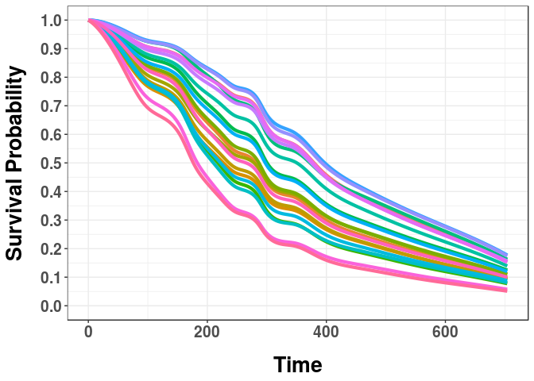

<!-- README.md is generated from README.Rmd. Please edit that file -->
MTLR
====

[](https://travis-ci.org/haiderstats/MTLR) [](https://codecov.io/gh/haiderstats/MTLR)

The goal of `MTLR` is to provide an R implementation for [Multi-Task Logistic Regression](https://papers.nips.cc/paper/4210-learning-patient-specific-cancer-survival-distributions-as-a-sequence-of-dependent-regressors). In addition to supplying the model provided by [Yu et al.](https://papers.nips.cc/paper/4210-learning-patient-specific-cancer-survival-distributions-as-a-sequence-of-dependent-regressors) we have extended the model for left censoring, interval censoring, and a mixture of censoring types. Functionality includes training an MTLR model, predicting survival curves for new observations, and plotting these survival curves and feature weights estimated by MTLR.

Installation
------------

You can install the version from CRAN or the development version from GitHub:

``` r
# CRAN:
install.packages("MTLR")

# GitHub:
# install.packages("devtools")
devtools::install_github("haiderstats/MTLR")
```

Example
-------

Given a survival dataset containing event time and event status indicator (censored/uncensored) we can produce an MTLR model. For example, consider the `lung` dataset from the `survival` package:

``` r
# Load survival for the lung dataset and the Surv() function.
library(survival)
mod <- mtlr(Surv(time,status)~., data = lung)
print(mod)
#> 
#> Call:  mtlr(formula = Surv(time, status) ~ ., data = lung) 
#> 
#> Time points:
#>  [1]  59.1  95.0 156.0 177.5 199.7 222.4 245.5 283.5 298.4 347.0 388.4
#> [12] 457.8 557.1 703.9
#> 
#> 
#> Weights:
#>           Bias      inst       age      sex   ph.ecog ph.karno pat.karno
#> 59.07   0.1784 -0.004789  0.052067 -0.03136  0.001151 -0.00416   0.00778
#> 95     -0.0105 -0.034747  0.037129 -0.00806 -0.000658  0.00203  -0.00588
#> 156     0.0746 -0.011978  0.034188  0.00306  0.015351 -0.01683  -0.00897
#> 177.53  0.2141 -0.008087  0.020318 -0.01803  0.018281 -0.01511  -0.02294
#> 199.67  0.0675 -0.010602  0.002078 -0.03276  0.033879 -0.01631  -0.02264
#> 222.4  -0.0507  0.000758 -0.000891 -0.04373  0.052941 -0.02910  -0.04352
#> 245.47 -0.0898  0.010489 -0.021223 -0.03104  0.058287 -0.03492  -0.05486
#> 283.53 -0.1859  0.009550 -0.010402 -0.04271  0.041010 -0.01473  -0.02896
#> 298.4  -0.1057  0.005423 -0.004378 -0.04710  0.049970 -0.02070  -0.02800
#> 347    -0.1465 -0.011233 -0.015575 -0.04147  0.036208 -0.00446  -0.01957
#> 388.4  -0.1230 -0.016376 -0.009324 -0.02713  0.022964 -0.00369  -0.01902
#> 457.8   0.0197 -0.004570 -0.006029 -0.01973  0.011486  0.01769  -0.00942
#> 557.07 -0.2920 -0.017959  0.016599 -0.01191  0.028154  0.00524  -0.01845
#> 703.93 -0.2226 -0.016177  0.026579 -0.02599  0.005341  0.01789  -0.00289
#>        meal.cal   wt.loss
#> 59.07  -0.02186 -0.000543
#> 95     -0.01962 -0.004327
#> 156    -0.00249 -0.032072
#> 177.53 -0.01522 -0.016285
#> 199.67 -0.01998 -0.025126
#> 222.4  -0.00838 -0.027900
#> 245.47 -0.01497 -0.010949
#> 283.53  0.00195 -0.025566
#> 298.4  -0.00511  0.004376
#> 347    -0.01130  0.014773
#> 388.4  -0.01288 -0.001208
#> 457.8  -0.01894 -0.012105
#> 557.07 -0.02057 -0.013214
#> 703.93  0.01736 -0.008696
#Plot feature weights:
plot(mod)
```


``` r

#Get survival curves for the lung dataset:
curves <- predict(mod)
#Plot the first 20 survival curves:
plotcurves(curves, 1:20)
```


