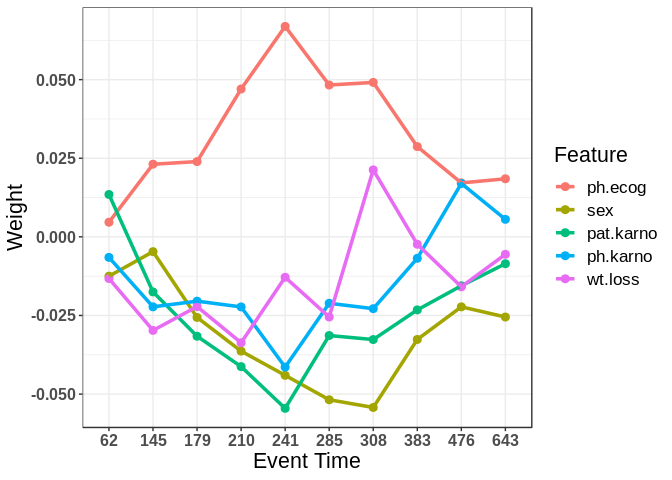
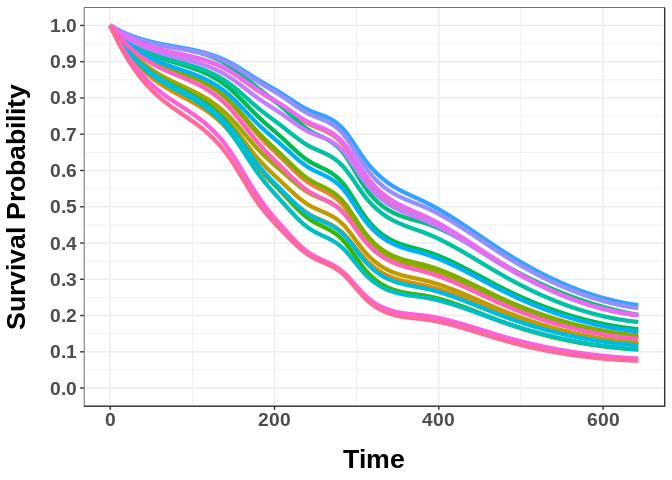

<!-- README.md is generated from README.Rmd. Please edit that file -->
MTLR
====

[](https://travis-ci.org/haiderstats/MTLR) [](https://codecov.io/gh/haiderstats/MTLR) 

The goal of `MTLR` is to provide an R implementation for [Multi-Task Logistic Regression](https://papers.nips.cc/paper/4210-learning-patient-specific-cancer-survival-distributions-as-a-sequence-of-dependent-regressors). In addition to supplying the model provided by [Yu et al.](https://papers.nips.cc/paper/4210-learning-patient-specific-cancer-survival-distributions-as-a-sequence-of-dependent-regressors) we have extended the model for left censoring, interval censoring, and a mixture of censoring types. Functionality includes training an MTLR model, predicting survival curves for new observations, and plotting these survival curves and feature weights estimated by MTLR.

Installation
------------

You can install the version from CRAN or the development version from GitHub:

``` r
# CRAN:
install.packages("MTLR")

# GitHub:
# install.packages("devtools")
devtools::install_github("haiderstats/MTLR")
```

Example
-------

Given a survival dataset containing event time and event status indicator (censored/uncensored) we can produce an MTLR model. For example, consider the `lung` dataset from the `survival` package:

``` r
# Load survival for the lung dataset and the Surv() function.
library(survival)
#Here we will use 9 intervals (10 time points) just for plotting purposes. 
#The default is sqrt the number of observations.
mod <- mtlr(Surv(time,status)~., data = lung, nintervals = 9)
print(mod)
#> 
#> Call:  mtlr(formula = Surv(time, status) ~ ., data = lung, nintervals = 9) 
#> 
#> Time points:
#>  [1]  62.3 145.4 179.3 210.4 241.4 284.5 308.2 383.5 476.3 642.8
#> 
#> 
#> Weights:
#>           Bias      inst      age      sex ph.ecog ph.karno pat.karno meal.cal  wt.loss
#> 62.27   0.1147 -0.017981  0.04891 -0.01249 0.00461 -0.00648   0.01352 -0.02617 -0.01325
#> 145.36  0.1362 -0.021147  0.03275 -0.00473 0.02312 -0.02227  -0.01753 -0.01105 -0.02974
#> 179.27  0.2119 -0.008203  0.02260 -0.02564 0.02394 -0.02046  -0.03161 -0.02310 -0.02218
#> 210.36  0.0398  0.000359  0.00816 -0.03638 0.04704 -0.02230  -0.04129 -0.01410 -0.03367
#> 241.36 -0.0996  0.009570 -0.01581 -0.04405 0.06690 -0.04139  -0.05453 -0.00808 -0.01288
#> 284.55 -0.2299  0.004869 -0.00476 -0.05180 0.04824 -0.02107  -0.03135  0.00237 -0.02552
#> 308.18 -0.3012 -0.007743 -0.00467 -0.05426 0.04908 -0.02280  -0.03264 -0.01608  0.02130
#> 383.45 -0.0289 -0.019985 -0.01030 -0.03263 0.02868 -0.00680  -0.02321 -0.01458 -0.00235
#> 476.27 -0.1285 -0.010232  0.00106 -0.02226 0.01715  0.01699  -0.01555 -0.02112 -0.01587
#> 642.82 -0.3513 -0.014975  0.02291 -0.02548 0.01847  0.00556  -0.00856  0.00373 -0.00552
#Plot feature weights:
plot(mod)
```



``` r
#Get survival curves for the lung dataset:
curves <- predict(mod)
#Plot the first 20 survival curves:
plotcurves(curves, 1:20)
```


