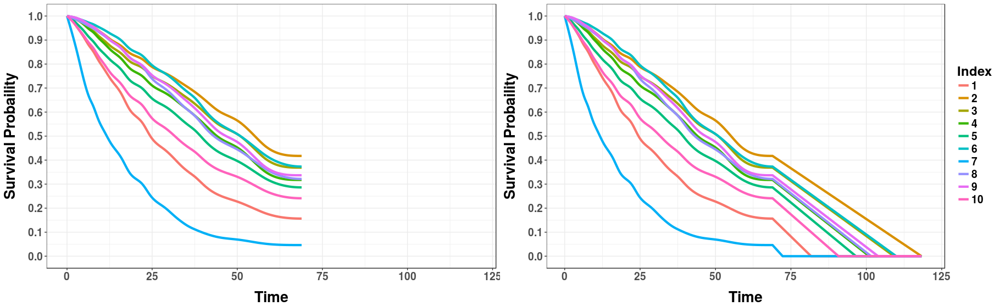
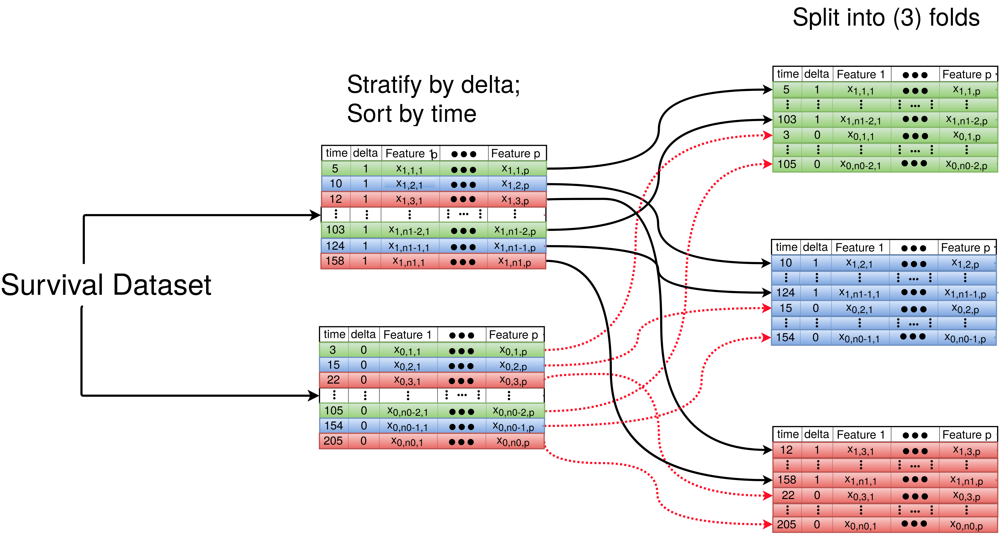

```{r setup, include = FALSE}
knitr::opts_chunk$set(
  collapse = TRUE,
  comment = "#>"
)
```


Here we give a brief introduction to using Multi-task Logistic Regression (MTLR) for survival prediction. Note that MTLR was specifically designed to give __survival probabilities__ across a __range of times__ for __individual observations__. This differs from models which produce risk scores (such as those given by Cox proportional hazards), single time probability models (such as the Gail model), and population wide models (*e.g.* Kaplan-Meier curves). Producing survival probabilities over a range of times gives a more holistic view of survival to patients and physicians which may be critical in making healthcare decisions. 

MTLR was introduced first in 2011 at NIPS under the name, ["Learning Patient-Specific Cancer Survival Distributions as a Sequence of Dependent Regressors"](https://papers.nips.cc/paper/4210-learning-patient-specific-cancer-survival-distributions-as-a-sequence-of-dependent-regressors). Since then much work has been done including a [website](http://pssp.srv.ualberta.ca/) which can be used to build MTLR models on uploaded data. While this is an extremely beneficial resource we have extended MTLR to be included in the R environment to make comparisons to other survival methods and use tools included in other R packages, such as `survival` and `randomForestSRC`.


MTLR can be used for survival data containing right, left, interval, or no censoring. In addition, these types of censoring can be mixed in the same dataset. Documentation on utilizing these different types of censoring can be found using `help(mtlr)`. In this vignette we will consider an example which includes right censoring only. Namely, we will be using the `lung` dataset from the `survival` package.

##Data: lung

One can access the `lung` dataset by loading the `survival` package.

```{r}
library(survival)
#Looking at the top 6 rows...
head(lung)
#help(lung) #See the basic information of lung.
```

If you look at the help file for `lung` you will see the following feature definitions:

* inst:	 Institution code
* **time**:	 Survival time in days
* **status**:	 censoring status 1=censored, 2=dead
* age:	 Age in years
* sex:	 Male=1 Female=2
* ph.ecog:	 ECOG performance score (0=good 5=dead)
* ph.karno:	 Karnofsky performance score (bad=0-good=100) rated by physician
* pat.karno:	 Karnofsky performance score as rated by patient
* meal.cal:	 Calories consumed at meals
* wt.loss:	 Weight loss in last six months

Most importantly you will notice the two features needed for every survival dataset for use of MTLR -- an event time (here `time`), 
and the indicator identifying if an observation is uncensored/censored (here `status`). For this example we have `status == 1` indicating a right censored individual and `status == 2` indicating an uncensored individual. Later on we will be using the `Surv` function to structure our survival data for MTLR -- there are other acceptable formats for the indicator feature (`status`) -- see `help(Surv)` for more information.

##Pre-processing

We will remove `inst` for this example since this is a categorical feature with 19 unique values and we would like to keep the number of features relatively small.

```{r}
lung <- lung[,-1]
```

Before progressing any further we will split our data into a training and testing set. Note that we could stratify our training/testing set by the censor status but for simplicity we skip that for now.

```{r}
numberTrain <- floor(nrow(lung)*0.8)
set.seed(42)
trInd <- sample(1:nrow(lung), numberTrain)
training <- lung[trInd,]
testing <- lung[-trInd,]
```

You may also notice that there are some missing values in the data, namely in `meal.cal` and `wt.loss` (although `ph.ecog`, `ph.karno`, and `pat.karno` also have missing values). The MTLR package does not handle missing values for users so this must be pre-processed ahead of time. If one passes in data which contains missing values anyway, all rows with missing values will be removed before model training/predictions. To remedy this problem we perform a very basic mean imputation on the dataset. Note that we use the means from the training set to impute the test set.

```{r}
#Perform imputation
trMeans <- colMeans(training,na.rm=T)
for(i in 1:ncol(training)){
  training[is.na(training[,i]), i] <- trMeans[i]
  testing[is.na(testing[,i]), i] <- trMeans[i]
}
```

##Model Training

Once the dataset has been prepared we can begin to play around with some of the functions found in the MTLR package. Most importantly we will be utilizing the `mtlr` function to train our model. There are a number of arguments that can be used by `mtlr`, though only a select few are discussed here. There are only two arguments required to train an `mtlr` model, **formula** and **data**. For **formula** we must structure our event time feature and censor indicator feature using the `Surv` function. Since we have `time` and `status` as these two features we can create our formula object:

```{r}
formula <- Surv(time,status)~.
```

The above says we will be training a model on the survival object created from `time` and `status` and using all the other features in our dataset as predictors. If we wanted to select a few features we could do this as well, for example, with `age` and `sex`.

```{r}
formulaSmall <- Surv(time, status)~age+sex
```

Next, we just need the **data** argument which in our case is ``training``. We can finally make our first model! 

```{r}
library(MTLR)
fullMod <- mtlr(formula = formula, data = training)
smallMod <- mtlr(formula = formulaSmall, data = training)
#We will print the small model so the output is more compact.
smallMod
```

There is a lot to take in at first from the output of the `mtlr` model. The first item is simply the call that was used to build the model. Next is the time points that `mtlr` used to train the model. If these time points are not specified when constructing the model then `mtlr` will choose time points based on the quantiles of the event time feature. Additionally, the number of time points is chosen to be the sqrt(N) where N is the number of observations. Since we had 205 training instances and the sqrt(205 = 14.317) `mtlr` rounded up to 15 time points. 

Last, `mtlr` outputs the weight matrix for the model -- these are the weights corresponding to each feature at each time point (additionally notice that we include the bias weights). The row names correspond to the time point for which the feature weight belongs. If you would like to access these weights, they are saved in the model object as `weight_matrix` so you can access them using `smallMod$weight_matrix`.

We can also plot the weights for a `mtlr` model. Before we printed the small model but here we will look at the weights for the complete model.


```{r, fig.width=7, fig.align="center"}
plot(fullMod)
```


By default, `plot` will only look at the 5 features which had the largest sum of absolute values across time (the most influence). You can alter these specifications by playing with the arguments in `plot`.

##Model Predictions

Now that we have trained a MTLR model we should make some predictions! This is where our `testing` set and the `predict` function will come into play. Note that there are a number of predictions we may be interested in acquiring. First, we may want to view the survival curves of our test observations.

```{r}
survCurves <- predict(fullMod, testing, type = "survivalcurve")
#survCurves is pretty large so we will look at the first 5 rows/columns.
survCurves[1:5,1:5]
```

When we use the `predict` function for survival curves we will be returned a matrix where the first column (time) is the list of time points that the model evaluated the survival probability for each observation (these will be the time points used by `mtlr` and an additional 0 point). Every following column will correspond to the row number of the data passed in, *e.g.* column 2 (named 1) corresponds to row 1 of `testing`. Each row of this matrix gives the probabilities of survival at the corresponding time point (given by the time column). For example, testing observation 1 has a survival probability of 0.919 at time 60.625. 

Since these curves may be hard to digest by observing a matrix of survival probabilities we can also choose to plot them.

```{r, fig.width=7, fig.height=5, fig.align="center"}
plotcurves(survCurves, 1:10)
```


Here we have specified that we want to observe the survival curves for the first 10 observations (corresponding to the first 10 rows of `testing`). You will notice that these curves have been smoothed whereas before we only had probabilities for certain time points. We have performed a monotonic spline fit to those survival probabilities to produce the curves you see here. 

Additionally, you may have specific plot specifications you want to make. `plotcurves` is simply returning a `ggplot2` object so specifications can be made like you would make to any other `ggplot2` graphic. For example, `plotcurves(survCurves, 1:10) + ggplot2::xlab("Days")` would change the x-axis label to "Days" instead of "Time".

###Mean/Median Survival Time 

In addition to the entire survival curve one may also be interested in the average survival time. This is again available from the `predict` function.

```{r}
#Mean
meanSurv <- predict(fullMod, testing, type = "mean_time")
head(meanSurv)
#Median
medianSurv <- predict(fullMod, testing, type = "median_time")
head(medianSurv)
```

Here the mean survival time corresponds to the area under the survival curve of each observation. One subtlety is that many survival curves never touch zero probability making this area not well-defined. When this occurs, a linear fit is drawn from the time = 0, survival probability = 1 point to the last time point and extended to the 0 probability time. For example, below we have drawn a linear extension on the curves below to calculate the mean survival time.

```{r, echo=FALSE, out.width = '90%', fig.align="center"}

```

This is also performed when calculating the median survival time if the last survival probability is above 0.5. 

##Survival Probability at Event Time

The last prediction type supported is acquiring the observations survival probability at the respective event time. However, in order to use this prediction, the event time (whether censored or uncensored) must be included in the features passed into the `predict` function. 

```{r}
survivalProbs <- predict(fullMod, testing, type = "prob_event")
head(survivalProbs)
#To see what times these probabilities correspond to:
head(testing$time)
```

You will notice that some of these survival probabilities correspond to 0 (usually those with very large event times). We again have drawn the linear extension for the survival time if the event time could not be mapped onto the survival curve.

##Miscellaneous Commands
###`mtlr_cv`
Previously we just used the default settings of `mtlr`. However, a number of things can be adjusted included the number of time points, the exact time points used, the initialization of the feature weights, and the regularization parameter (C1) which corresponds to the C1 given in the [NIPS paper](https://papers.nips.cc/paper/4210-learning-patient-specific-cancer-survival-distributions-as-a-sequence-of-dependent-regressors). The `mtlr_cv` function helps to select a value of C1. Given a vector of values to test for C1, `mtlr_cv` will do internal cross validation to select the optimal C1 for some criteria. Currently the only optimization is referred to as the log-likelihood loss (see the "Details" section of `help(mtlr_cv)`). For example, we use this command with 5 values of C1 (although there is a default of (0.001,0.01,0.1,1,10,100,1000)).

```{r}
mtlr_cv(formula,training, C1_vec = c(0.01,0.1,1,10,100))
```

The output gives us the best value of C1 and the losses for the values tested. Once we have the best value of C1 we can then use the `mtlr` function with the chosen value of C1. 

###`create_folds`

As we mentioned, `mtlr_cv` uses an internal k-fold cross validation to evaluate the loss. We also export the function (`create_folds`) used to create these cross-validation folds as it is creating folds in a unique way.

These folds can be deterministic, semi-deterministic, or totally random. The deterministic folds arise by stratifying folds by censor status and attempting to create equal ranges in the event times within each fold. This is done by first stratifying the survival dataset into a censored and uncensored portion and then sorting each portion by the event time. These portions are then numbered off into k different folds (see figure below). This option corresponds to "fullstrat".

```{r, echo=FALSE, out.width = '90%',fig.cap='The "fullstrat" method of cross-fold validation. Here "delta" refers to the feature used to identify censored/uncensored observations.', fig.align="center"}

```

The semi-deterministic method stratifies the folds by censor status but ignores event time. In the figure above this would be the same process but skipping the sorting of time. This option is called "censorstrat". The completely random method ignores the censor status and the event time and randomly assigns observations to folds -- the "random" option.

We include the `create_folds` function in the event one would want to perform k-fold cross-validation on their dataset instead of using a training/testing split. For example, one could set up for 5-fold cross-validation like so:

```{r}
#Recall we are using the lung dataset.
testInd <- create_folds(lung$time, lung$status, nfolds = 5, foldtype = "fullstrat")
```

Now `testInd` is a list of length 5 where each of the 5 items are the indices of the test set to be used for each fold. One could now use a `for` loop and iterate over 5-folds and index `lung` by the test indices  (`lung[testInd,]`) for the test set and all but the test indices (`lung[-testInd,]`) for the training set and train these 5 models.

##Evaluation

The MTLR package does not directly supply functions on how to evaluate the survival curves, but instead the methods to produce these curves. For a detailed discussion on a variety of evaluation metrics and access to some R-scripts containing evaluation code please see the paper [Effective Ways to Build and Evaluate Individual Survival Distributions](https://arxiv.org/abs/1811.11347).
